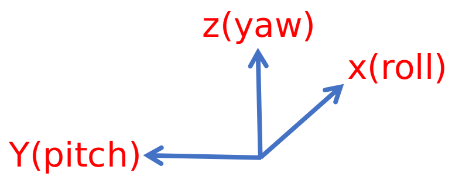
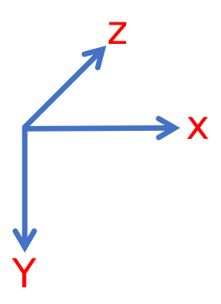
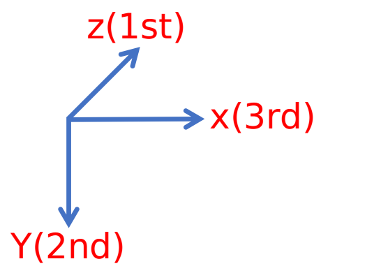
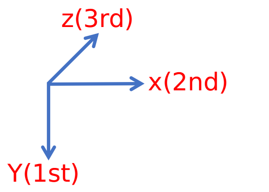
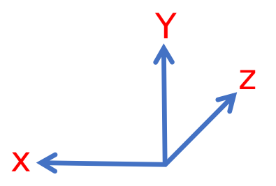
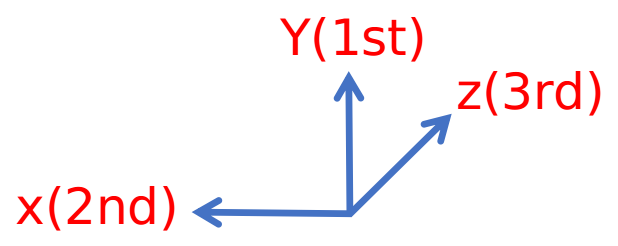
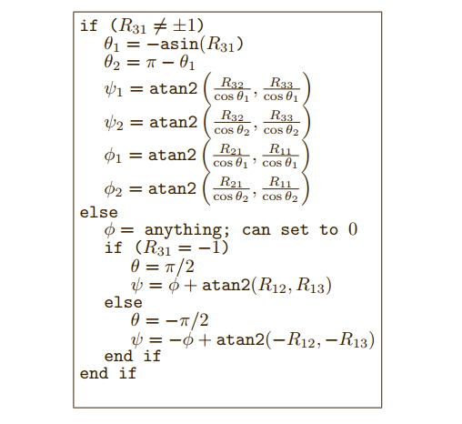

# Eigen::eulerAngles()函数注意事项

[TOC]

## 1 Eigen::eulerAngles($a_0$,$a_1$,$a_2$) 

- **函数功能**：将Eigen::Matrix3d类型的旋转矩阵转换为欧拉角。

- **输入**： Eigen::Matrix3d类型的旋转矩阵。

- **输出**： 欧拉角。

- **$a_0$-0(x轴)**，**$a_1$-1(y轴)**，**$a_2$-2(z轴)**。

- **注意**：列如参数中（2,1,0）表示了三个欧拉角右乘顺序（在右手坐标系下）。不同的顺序，得出来的角度都不相同。这里欧拉角的定义如下：roll角指的是横滚角，pitch角指的是俯仰角，yaw角指的是偏航角。

  <center>
    
  </center>
  
  (2,1, 0)---yaw×pitch×roll顺序，一般情况下旋转矩阵都会以这个顺序进行旋转，表示先转**z轴**，再转**y轴**，最后转**x轴** 。三个轴的取值范围分别为：**yaw-[0:pi],pitch-[-pi,pi],roll-[-pi,pi]**。
  
  **(0,1,2),(2,0,1),(1,0,2)**等其他顺序表示了坐标系与标准roll,pitch,yaw角不一致时的顺序。

## 2 注意事项

### 问题1：不同的旋转顺序，得到的欧拉角需要满足的条件？

```c++
Eigen::Matrix3d matrix = Eigen::Matrix3d::Identity();
Eigen::Vector3d euler_angle = matrix.eulerAngles(2,1,0);

//欧拉角得到的矩阵应该满足
Eigen::Matrix3d matrix_check;
matrix_check =Eigen::AngleAxisd(euler_angle[0], Eigen::Vector3d::UnitZ()) *                       Eigen::AngleAxisd(euler_angle[1], Eigen::Vector3d::UnitY()) *
              Eigen::AngleAxisd(euler_angle[2], Eigen::Vector3d::UnitX()); 

```

### 问题2：其他不同的旋转顺序，应该在什么场景下使用？

- 以相机坐标系为例:

  <center>
      
  </center>

  如果采用**eulerAngles(2,1,0)**,也就是**Z-Y-X**顺序

  <figure class = "third">
      
      
  </figure>


  在这种情况下，采用**eulerAngles(1,0,2**)顺序，**Y-X-Z**顺序。

- 非标准相机坐标系：

  <center>
      
  </center>

  常规旋转顺序：
  
  <center>
      
  </center>
  
  
  在这种情况下，采用**eulerAngles(1,0,2)**顺序，**Y-X-Z**顺序。


## 3 通解

-  分别绕**X轴Y轴Z轴**的旋转定义如下：

​       $$   R(x) = \begin{bmatrix} 1 & 0 & 0 \\\\ 0 & cosx & -sinx \\\\ 0 & sinx & cosx \end{bmatrix} R(y) = \begin{bmatrix} cos(y) & 0 & sin(y) \\\\ 0 & 1 & 0 \\\\ -sin(y) & 0 & cos(y)\end{bmatrix} R(z) = \begin{bmatrix}cos(z) & -sin(z) & 0\\\\ sin(z) & cos(z) & 0\\\\0& 0 & 1\end{bmatrix}$$


- 按照标准**roll-pitch-yaw**旋转顺序$R = R(z)R(y)R(x)$ :

  $$R = \begin{bmatrix}cos(y)cos(z) & sin(x)sin(y)cos(z)-cos(x)sin(z)& cos(x)sin(y)cos(z)+sin(x)sin(z)\\\\ cos(y)sin(z)&sin(x)sin(y)sin(z)+cos(x)cos(z) & cos(x)sin(y)sin(z)-sin(x)cos(z)\\\\ -sin(y) & sin(x)cos(y) &cos(x)cos(y)\end{bmatrix}$$

- 首先求解$y$

  - $y = -sin^{-1}(R_{31})$

    - 情况1：当$R_{31} \neq \pm 1$

      $y_1 = -sin^{-1}(R_{31})$

      $y_2 = \pi - y_1 = \pi + sin^{-1}(R_{31})$

    - 情况2：当$R_{31} = 1$

      $y = \pi / 2$

    - 情况3：当$R_31 = -1$

      $y = -\pi / 2$

- 其次求解x

  - $$tan(x) = \frac{R_{32}}{R_{33}} = \frac{sin(x)cos(y)}{cos(x)cos(y)}$$

    - 情况1：当$ cos(y) \neq 0  \&\&  cos(y) > 0$:

      $x = atan2(R_{32},R_{33})$

    - 情况2：当$cos(y)\neq 0 \&\&cos(y) < 0$:

      $x = atan2(-R_{32},-R_{33})$

  - 综上:

    $x_{1} = atan2(\frac{R_{32}}{cos{y_1}},\frac{R_{33}}{cos(y_1)})$

    $x_{2} = atan2(\frac{R_{32}}{cos{y_2}},\frac{R_{33}}{cos(y_2)})$

- 最后求解$z$

  - $tan(z) = \frac{R_{21}}{R_{11}} = \frac{cos(y)sin(z)}{cos(y)cos(z)}$

    - 情况1：当$ cos(y) \neq 0  \&\&  cos(y) > 0$:

      $z = atan2(R_{21},R_{11})$

    - 情况2：当$cos(y)\neq 0 \&\&cos(y) < 0$:

      $z = atan2(-R_{21},-R_{11})$

  - 综上：

    $z_{1} = atan2(\frac{R_{21}}{cos{y_1}},\frac{R_{11}}{cos(y_1)})$

    $z_{z} = atan2(\frac{R_{21}}{cos{y_2}},\frac{R_{11}}{cos(y_2)})$

- 特殊情况：当$cos(y) = 0$ 即$sin(y) = \pm 1$

  - 情况1：$sin(y) = 1$ 即 $y = \pi /2$

    - $R_{12} = sin(x)cos(z) - cos(x)sin(z) = sin(x -z)$

      $R_{13} = cos(x)cos(z) + sin(x)sin(z) = cos(x-z)$

      $R_{22} = sin(x)cos(z) + cox(x)cos(z) = cos(x-z) = R_{13}$

      $R_{23} = cos(x)sin(z)  - sin(x)cos(z) = -sin(x - z) = -R_{12}$

      $=>x-z = atan2(R_{12},R_{13})$

      $=>x = z + atan2(R_{12},R_{13})$

      取$z = 0 则 x= atan2(R_{12},R_{13})$

  - 情况2：$sin(y) = - 1$ 即 $y = -\pi /2$

    - $R_{12} = -sin(x)cos(z) - cos(x)sin(z) = - sin(x + z)$

      $R_{13} =- cos(x)cos(z) + sin(x)sin(z) = -cos(x+ z)$

      $R_{22} =- sin(x)cos(z) + cox(x)cos(z) = cos(x+ z) = -R_{13}$

      $R_{23} = -cos(x)sin(z)  - sin(x)cos(z) = -sin(x + z) = R_{12}$

      $=>x + z = atan2(-R_{12},-R_{13})$

      $=>x = -z + atan2(-R_{12},-R_{13})$

      z取$z = 0 则 x= atan2(-R_{12},-R_{13})$

- 流程框图

  <center>
      
  </center>

  

- 代码

  ```c++
  double roll = 0.0;
  double pitch = 0.0;
  double yaw = 0.0;
  Eigen::Matrix3f rotation = transform_matrix_.topLeftCorner(3, 3); 
  
  if ((rotation(2, 0) != 1) || (rotation(2, 0) != -1))
      {
        pitch = -std::asin(rotation(2, 0));
        if (pitch > M_PI / 2)
        {
          pitch = M_PI - pitch;
        }
        else if (pitch < -M_PI / 2)
        {
          pitch = -M_PI - pitch;
        }
        roll = std::atan2(rotation(2, 1) / cos(pitch), rotation(2, 2) / cos(pitch));
        yaw = std::atan2(rotation(1, 0) / cos(pitch), rotation(0, 0) / cos(pitch));
      }
      else
      {
        yaw = 0;
        if (rotation(2, 0) == -1)
        {
          pitch = M_PI / 2;
          roll = yaw + std::atan2(rotation(0, 1), rotation(0, 2));
        }
        else
        {
          pitch = -M_PI / 2;
          roll = -yaw + std::atan2(-rotation(0, 1), -rotation(0, 2));
        }
      }
  ```

  

## 4 参考

[Eigen::Geometry module](<https://eigen.tuxfamily.org/dox/group__Geometry__Module.html#ga17994d2e81b723295f5bc3b1f862ed3b>)

[Computing Euler angles from a rotation matrix](<http://www.gregslabaugh.net/publications/euler.pdf>)

