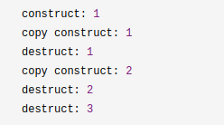
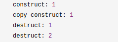

# C++从四行代码看右值引用

[TOC]

## 概述

右值引用的概念有些读者会感到陌生，其实他和c++98/03中的左值引用有些类似，例如，c++98/03中的左值引用是这样的：

```c++
int i = 0;
int& j = i;
```

这里的`int&`是对左值进行绑定（但是`int&`却不能绑定右值），相应的，对右值进行绑定的引用就是右值引用，它的语法是这样的`A&&`，通过双引用号来表示绑定类型为`A`的右值。通过`&&`我们就可以很方便地绑定右值了，比如我们可以这样绑定一个右值：

```c++
int&& i = 0;
```

这里我们绑定了一个右值`0`，由于右值的概念后面介绍。右值引用是c++11中新增加的一个很重要的特性，主要是用来解决c++98/03中遇到的两个问题，第一个问题就是临时对象非必要的昂贵的拷贝操作，第二个问题是在模板函数中如何按照参数的实际类型进行转发。通过引入右值引用，很好的解决了这个问题。

右值引用实际上并没有那么复杂，其实是关于4行代码的故事，通过简单的4行代码我们就能清晰的理解右值引用相关的概念了。

## 四行代码的故事

### 第一行代码的故事

```c++
int i = getVar();
```

上面个的这行代码很简单，从`getVar()`函数中获得一个整形值，然而，这行代码会产生几种类型的值呢？答案是会产生两种类型的值，一种是左值`i`,一种是函数`getVar()`返回的临时值，这个临时值在表达式结束后就销毁了，而左值`i`在表达式结束后仍然存在，这个临时值就是右值，具体来说是一个纯右值，右值是不具名的。区分左值和右值的一个简单办法是：看能不能对表达式取地址，如果能，则为左值，否则为右值。

所有的具名变量或对象都是左值，而匿名变量则是右值，比如，简单的赋值语句：

```c++
int i = 0;
```

在这条语句中，`i`就是左值，`0`是字面量，就是右值。在上面的代码中，`i`可以被引用，`0`就不可以了。具体来说上面的表达式中等号右边的`0`是纯右值，在c++11中所有的值比属于左值，將亡值，纯右值三者之一。比如，非引用返回的临时变量、运算表达式产生的临时变量、原始字面量和lambda表达式等都是纯右值。而將亡值是c++11新增的、与右值引用相关的表达式，比如，将于被移动的对象、`T&&`函数返回值、`std::move()`返回值和转换为`T&&`的类型的转换函数的返回值。关于將亡值后面会介绍。

```c++
int j = 5;
auto f = []{return 5};
```

上面的代码中`5`是一个原始字面量，`[]{return 5}`是一个lambda表达式，都是属于纯右值，它们的特点是表达式结束之后就销毁了。

### 第二行代码的故事

```c++
T&& k = getVar();
```

第二行代码和第一行代码很像，只是比第一行代码多了`&&`，它就是右值引用，我们知道左值引用是对左值的引用，那么，相应的，对右值的引用就是右值引用，而且右值是匿名变量，我们也只能通过引用的方式来获取右值。虽然第二行代码和第一行代码差别不大，但是实际上语义差别很大，这里，`getVar()`产生的临时值不会像第一行代码那样，在表达式结束之后就销毁了，而是会被”续命“，它的生命周期将会通过右值应用得以延续，和变量`k`的声明周期一样长。

- 右值引用的第一个特点

  通过右值引用的声明，右值又”重获新生“，其生命周期与右值引用类型变量的生命周期一样长，只要该变量还活着，该右值临时量将会一直存活下去。

  ```c++
#include <iostream>
  
  int g_constructCount = 0;
  int g_copyConstructCount = 0;
  int g_destructCount = 0;
  struct A
  {
    A()
    {
        std::cout << "construct" << ++g_constructCount << std::endl;
    }
    A(const A& a)
    {
        std::cout << "copy construct" << ++g_copyConstructCount << std::endl;
    }
    ～A()
    {
        std::cout << "destruct" << ++g_destructCount << std::endl;
    }
  };
  
  A getA()
  {
      return A();
  }
  
  int main()
  {
      A a = getA();
      return 0;
  }
  ```
  
  输出结果：

  

  从上面的例子可以看出，在没有返回值优化的情况下，拷贝构造函数调用了两次，一次是`getA()`函数内部创建的对象返回出来构造一个临时对象产生的，另一次是`main`函数中构造`a`产生的。第二次的`destruct`是因为临时对象在构造`a`对象后就销毁了。

  如果采用右值引用的话，会是深么情况？

  ```c++
int main()
  {
      A&& a = getA();
      return 0;
  }
  ```
  
  输出结果:

  

通过右值引用，比之前少了一次拷贝构造和一次析构，原因在与绑定了右值，让临时右值的生命周期延长了。我们可以利用这一特点做一些性能优化，即避免临时对象的拷贝构造和析构。事实上，在c++98/03中，通过常量左值引用也经常用来做性能优化。上面个的代码改成：

```c++
const A& a = getA();
```


输出的结果和右值引用一样，因为常量左值引用是一个“万能引用”，可以接受左值，右值，常量左值，常量右值。需要注意的是普通的左值引用不能接受右值，比如这样的写法是不对的：

```c++
A& a = getA();
```

上面的代码会报编译错误，因为非常量引用只能接受左值。

- 右值引用的第二个特点

  右值引用独立于左值和右值。意思是右值引用类型的变量可能是左值也可能是右值。比如：

  ```c++
  int&& var1 = 1;
  ```

  `var1`类型为右值引用，但`var1`本身是左值，因为具名变量都是左值。

  关于右值引用一个有意思的问题是：`T&&`是什么，一定是右值吗？看下面这个例子：

  ```c++
  template<typename T>
  void f(T&& t){}
  
  f(10);//t是右值
  
  int x = 10;
  f(x);//t是左值
  ```

  从上面的代码中可以看到，`T&&`表示的类型不确定，可能是左值又可能是右值，这一点看起来比较奇怪。

- 右值引用的第三个特点

  `T&& t`在发生自动类型推断的时候，它是未定义的引用类型，如果被一个左值初始化，他就是一个左值，如果他被一个右值初始化，它就是一个右值，它是左值还是右值取决它的初始化。需要注意的是，仅仅是当发生自动类型推导（如函数模板的类型自动推导，或auto关键字）的时候。在看下面的例子:

  ```c++
  template<typename T>
  void f(T&& param);
  
  template<typename T>
  class Test
  {
     Test(Test&& rhs); 
  }；
  ```

  上面的例子中`param`是`universal reference`,`rhs`是右值引用，因为模板函数发生了类型推断，而`Test&&`没有发生类型推断，因为`Test&&`是确定的类型了。

  正是因为右值引用可能是左值也可能是右值，依赖于初始化，可以利用这一点做很多文章，比如移动语义和完美转发。

  这里在提一下引用折叠，正是因为引入了右值引用，所以可能存在左值引用与右值引用和右值引用与右值引用的引用折叠，c++11确定了引用折叠的规则：

  - 所有的的右值引用叠加到右值引用上仍然还是一个右值引用；
  - 所有的其他类型的之间的叠加都将变成左值引用；

### 第三行代码的故事

  这行代码实际上来自一个类的构造函数，构造函数的一个参数是右值引用，为什么将右值引用作为构造函数的参数呢？先看如下例子：

  ```c++
  class A 
  {
      public:
      	A():m_ptr(new int(0))
          {
              std::cout << "construct" << std::endl;
          }
      	A(const A& a):m_ptr(new int(*a.m_ptr))
          {
              std::cout << "copy construct" << std::endl;
          }
       ~A()
       {
           delete m_ptr;
       }
      private:
      int* m_ptr;
  };
  
  int main()
  {
      A a = getA();
      return 0;
  }
  
  输出：
  construct
  copy construct
  copy construct
  ```

  这个例子中，一个带有堆内存的类，必须提供一个深拷贝构造函数，因为默认的拷贝构造函数是浅拷贝，会发生指针悬挂问题。如果不提供深拷贝构造函数，内部的`m_ptr`指针会被删除两次，一次是临时右值析构的时候删除一次，第二次外面构造的`a`对象释放时删除一次，而这两个对象的`m_ptr`是同一个指针，这就是所谓的指针悬挂问题。提供深拷贝构造函数虽然可以保证正确，但是在有些时候会造成额外损耗，因为有时会这种深拷贝是不必要的。比如下面这句：

  ```c++
  A a = getA();
  ```

  上面的`getA()`函数会返回临时变量，然后通过临时变量拷贝构造一个新的对象`a`，临时变量在拷贝构造完成之后就销毁了，如果堆内存很大的话，这个拷贝构造的代价会很大，带来了额外性能的损失。c++11采用如下方式解决：

  ```c++
  class A
  {
      public:
    		A():m_ptr(new int(0)){}
      	A(const A& a):m_ptr(new *(a.m_ptr))
          {
              std::cout << "copy construct" << std::endl;
          }
      	A(A&& a):m_ptr(a.m_ptr)
          {
              a.m_ptr = nullptr;
              std::cout << "move construct" << std::endl;
          }
      	~A()
          {
              delete m_ptr;
          }
  };
  
  int main()
  {
      A a = getA();
  }
  输出：
  construct
  move construct
  move construct
  ```

  上面这个操作就避免到了临时变量的深拷贝问题。

  上面个这个构造函数其实就是移动构造函数，它的参数是一个右值引用类型。为什么会匹配到这个构造函数？因为这个构造函数只能接受右值参数，而函数返回值是右值。对于临时值仅仅需要做浅拷贝，无需做深拷贝，从而解决了前面提到的临时变量拷贝构造产生的性能损失问题。这就是所谓的移动语义。

  需要注意的一个细节是，我们提供移动构造函数的同时也会提供一个拷贝构造函数，以防止移动不成功的时候还能拷贝构造，更加安全。

  我们知道移动语义是通过右值引用来匹配临时值的，那么普通左值能否借助移动语义来优化性能呢？c++11为了解决这个问题，提供了`std::move()`方法来讲左值转换为右值，从而方面应用移动语义。看下面的例子：

  ```c++
  std::list<std::string> tokens;
  ...
  std::list<std::string> t = tokens; //存在拷贝
  /////////////////////////////
  std::list<std::string> tokens;
  std::list<std::string> t = std::move(tokens);//没有拷贝
  
  ```

  如果不同`std::move()`,拷贝的代价很大，性能比较低。使用`move`几乎没有任何代价，只是转换了资源的所有权。它实际上将左值变成右值，热按后应用移动语义，调用移动构造函数，避免了拷贝，提高了性能。如果一个对象背部有较大的内存或者动态数组，很有必要写`move`语义的拷贝构造函数和赋值函数，避免无所谓的深拷贝。事实上，c++11中所有的容器都是实现了移动语义。所以`move`对于含有资源（堆或句柄）的对象来说更有意义。

### 第四行代码故事

  ```c++
  template <tempname T>void f(T&& val){ foo(std::forward<T>(val));}
  ```

  c++11在之前调用模板函数时，存在一个比较头疼的问题，如何正确的传递参数。不如：

  ```c++
  template <typename T>
  void forwardValue(T& val)
  {
      processValue(val);//右值参数会变成左值
  }
  
  template <typename T>
  void forwardValue(const T& val)
  {
      processValue(val);//参数都变成常量左值引用了
  }
  ```

  都不能按照参数本省的类型来进行转发。

  c++11引入了完美转发：在函数模板中，完全依照模板的参数的类型（即保持参数的左值，右值特征），将参数传递给函数模板中调用的另外一个函数。c++11中的`std::forward`正是做这个事情，它会按照参数的实际类型进行转发。

  ```c++
  void processValue(int& a){std::cout << "lvalue" << std::endl;}
  void processValue(int&& a){std::cout << "rvalue" << std::endl;}
  
  template <tempname T>
  void forwardValue(T&& val)
  {
      processValue(std::forward<T>(val));//按照阐述本来的类型进行转发
  }
  
  void test()
  {
      int i = 0;
      forwardValue(i);//传入左值
      forwardValue(0);//传入右值
  }
  输出：
  lvalue
  rvalue
  ```

  右值引用`T&&`是一个`universal references`,可以接受左值或者右值，正是这个特性让它适合作为一个参数的路由，然后通过`std::forward`按照参数的实际类型去匹配对应的重载函数，最终实现完美转发。

  我们可以结合完美转发和移动语义来实现一个泛型的工厂函数，这个工厂函数可以创建所有类型的对象。具体实现如下：

  ```c++
  template<typename... Args>
  T* Instance(Args&& args)
  {
      return new T(std::forward<Args>(args));
  }
  ```

  这个工厂函数的参数是右值引用类型，内部使用`std::forward`按照参数的实际类型进行转发，如果参数的实际类型是右值，那么创建的时候会自动匹配移动构造，如果是左值则会匹配拷贝构造。

  