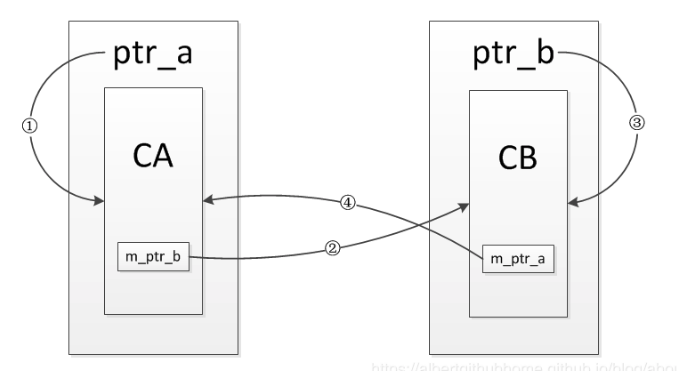
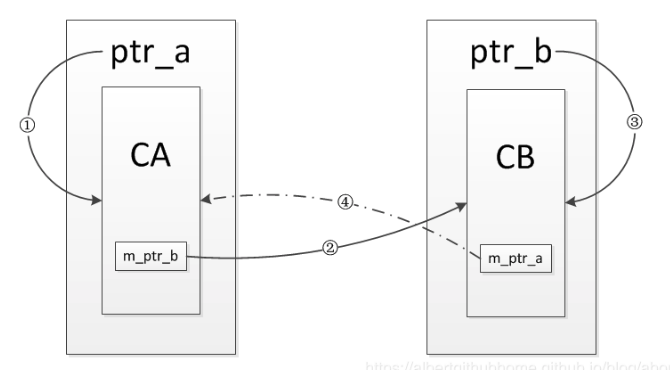

# C++智能指针weak_ptr详解

[TOC]

## 前言

`weak_ptr`这个指针天生一副小弟的模样，也是在c++11引入的标准库，它的出现完全是为了弥补`shared_ptr`的缺陷。其实相比于上一代智能指针`auto_ptr`来说，`shared_ptr`可以说近乎完美，但是通过引用计数实现它，虽然解决了指针独占的问题，但是也引入了引用成环的问题，这个问题靠它自己是没有办法完美解决的，所以将`shared_ptr`和`weak_ptr`一起引入了标准库，用来解决循环引用的问题。

`weak_ptr`本身也是一个模板类，但是不能直接用它来定义一个只能指针的对象，只能配合`shared_ptr`来使用，可以将`shared_ptr`的对象赋值给`weak_ptr`，并且这样并不会改变引用计数的值。`weak_ptr`的操作主要有：

- lock
- swap
- expired
- operator=
- use_count

没有`get()`,以及`operator*` ,`oprator->`。

## 使用weak_ptr解决shared_ptr循环引用问题

定义两个类，每个类中又包含一个指向对方类型的智能指针作为成员变量。

```c++
class CB;
class CA
{
  public:
    CA()
    {
        std::cout << "CA() called!" << std::endl;
    }
    ~CA()
    {
        std::cout << "~CA() called!" << std::endl;
    }
    void set_ptr(shared_ptr<CB>& ptr)
    {
       cb_ptr_ = ptr;
    }
    void b_use_count()
    {
        std::cout << "ptr_ca_ use count: " << ptr_ca_.use_count() << std::endl;
    }
    void show()
    {
        std::cout << "this ia class CA" << std::endl;
    }
  private:
    shared_ptr<CB> cb_in_ca_ptr_;
};

class CB
{
    public:
    	CB()
        {
            std::cout << "CB() called" << std::endl;
        }
    	~CB()
        {
            std::cout << "~CB() called" << std::endl;
        }
    	void set_ptr(shared_ptr<CA>& ptr)
        {
            ca_in_cb_ptr_ = ptr;
        }
    	void a_use_count()
        {
            std::cout << "a use count: " << ca_in_cb_ptr_.use_count() << std::endl;
        }
    	void show()
        {
            std::cout << "this is class CB" << std::endl;
        }
    private:
    	shared_ptr<CA> ca_in_cb_ptr_;
}

void test_refer_to_each_other()
{
    shared_ptr<CA> ca_ptr(new CA());
    shared_ptr<CB> cb_ptr(new CB());
    
    std::cout << "a use count: " << ca_ptr.use_count() << std::endl;
    std::cout << "b use count: " << cb_ptr.use_count() << std::endl;
    
    ca_ptr->set(cb_ptr);
    cb_ptr->set(ca_ptr);
    
    std::cout << "a use count: " << ca_ptr.use_count() << std::endl;
    std::cout << "b use count: " << cb_ptr.use_count() << std::endl;
}
```

测试结果如下：

```c++
CA() called
CB() called
a use count: 1
b use count: 1
a use count: 2
b use count: 2
```

通过结果可以看到，最后`CA`和`CB`对象并没有析构，其中的引用效果如下图所示，起初定义完`ca_ptr`和`cb_ptr`时，只有①③两条引用，然后调用函数`set_ptr()`后又增加了两条引用，当`test_refer_to_each_other`这个函数返回时，对象`ca_ptr`和`cb_ptr`被销毁，也就是①③被销毁，但是②④两条引用依然存在，每一个引用计数都不为0，结果就导致其指向的内部对象无法析构，造成内存泄漏。




解决这种状况的办法就是将两个类中的一个成员变量改为`weak_ptr`，因为`weak_ptr`不会增加引用计数，使得引用形不成环，最后就可以正常释放内部的对象，不会造成内存泄漏，比如，将`CB`中的成员变量改为`weak_ptr`对象，代码如下：

```c++
class CB
{
    public:
    	CB()
        {
            std::cout << "CB() called" << std::endl;
        }
    	~CB()
        {
            std::cout << "~CB() called" << std::endl;
        }
    	void set_ptr(shared_ptr<CA>& ptr)
        {
            ca_in_cb_ptr_ = ptr;
        }
    	void a_use_count()
        {
            std::cout << "a use count: " << ca_in_cb_ptr_.use_count() << std::endl;
        }
    	void show()
        {
            std::cout << "this is class CB" << std::endl;
        }
    private:
    	weak_ptr<CA> ca_in_cb_ptr_;
}
```

测试结果如下：

```c++
CA() called
CB() called
a use count: 1
b use count: 1
a use count: 1
b use count: 2
~CA() called
~CB() called
```

通过这次结果可以看到，两个对象都被析构了，引用关系如下图所示，流程与上一例子相似，但是不同的是④这条引用通过`weak_ptr`建立的，并不会增加引用计数，也就是说`CA`的对象只有1引用计数，而`CB`的对象有2个引用计数，当`test_refer_to_each_other`这个函数返回时，对象`ca_ptr`和对象`cb_ptr`被销毁，①③两条引用被断开，此时对象`CA`的引用计数会减为0，对象被销毁，其内部的成员变量`cb_in_ca_ptr_`也会被析构，导致对象`CB`的引用计数减为0，对象`CB`被销毁，进而解决了引用成环的问题。



## weak_ptr对引用计数的问题

其实`weak_ptr`本身设计的很简单，就是为了辅助`shared_ptr`，它本身不能直接定义指向原始指针的对象，只能指向`shared_ptr`对象，同时也不能将`weak_ptr`对象直接赋值给`shared_ptr`类型的变量，最重要的一点是赋值给它不会增加引用计数：

```c++
void test()
{
    shared_ptr<CA> ca_ptr(new CA());
    std::cout << "ca_ptr use count: " << ca_ptr.use_count() << std::endl;
    
    shared_ptr<CA> ca_ptr2 = ca_ptr;
    std::cout << "ca_ptr use count: " << ca_ptr.use_count() << std::endl;
    std::cout << "ca_ptr2 use count: " << ca_ptr2.use_count() << std::endl;
    
    weak_ptr<CA> wk_ca_ptr = ca_ptr;
    std::cout << "ca_ptr use count: " << ca_ptr.use_count() << std:endl;
    std::cout << "ca_ptr2 use count: " << ca_ptr2.use_count() << std::endl;
}
```

测试输出：

```c++
ca_ptr use count: 1
ca_ptr use count: 2
ca_ptr2 use count: 2
ca_ptr use count: 2
ca_ptr2 use count: 2
```

## weak_ptr的常用方式

`weak_ptr`中只有函数`lock`和`expired`两个函数比较重要。因为它本身不会增加引用计数，所以它指向的对象可能在它用的时候已经被释放了，所以在用之前需要使用`expired`函数来检测是否已过期，然后使用`lock`函数来获取其对应的`shared_ptr`对象，然后进行操作:

```c++
void test()
{
    shared_ptr<CA> ca_ptr(new CA());
    shared_ptr<CB> cb_ptr(new CB());
    
    std::cout << "ca_ptr use count: " << ca_ptr.use_count() << std::endl;
    std::cout << "cb_ptr use count: " << cb_ptr.use_count() << std::endl;
    
    weak_ptr<CA> ca_weak_ptr = ca_ptr;
    weak_ptr<CB> cb_weak_ptr = cb_ptr;
    
    if(!ca_weak_ptr.expired())
    {
        ca_weak_ptr.lock()->show();
    }
    if(!cb_weak_ptr.expired())
    {
        cb_weak_ptr.lock()->show();
    }
    
    cb_weak_ptr.reset();
    if(cb_weak_ptr.expired())
    {
        std::cout << "cb_weak_ptr is invalid" << std::endl;
    }
    
    cb_weak_ptr = cb_ptr;
    if(!cb_weak_ptr.expired())
    {
        cb_weak_ptr.lock()->show();
    }
   
    cout << "ca_ptr use count: " << ca_ptr.use_count() << std::endl;
    cout << "cb_ptr use count: " << cb_ptr.use_count() << std::endl;
    
}
```

## 总结

- `weak_ptr`虽然是一个模板类，但是不能用来直接定义指向原始指针的对象。
- `weak_ptr`接受`shared_ptr`类型的变量赋值，但是反过来是行不通的，需要使用`lock`函数
- `weak_ptr`设计之初就是为了服务与`shared_ptr`的，所以不增加引用计数就是它的核心功能
- 由于不确定`weak_ptr`所指的对象什么时候被析构掉，所以使用之前请先使用`expired`函数检测

## 参考

[C++智能指针weak_ptr详解](https://blog.csdn.net/albertsh/article/details/82286999)