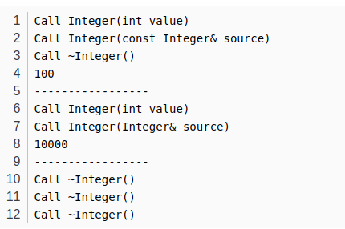
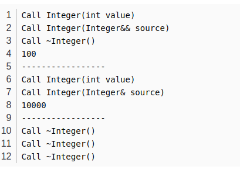
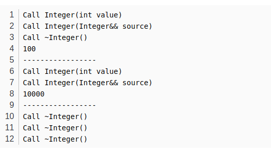

# c++移动构造函数

[TOC]

## 引言

移动构造函数是什么？先举个例子，你有一本书，你不想看，但我很想看，那么我有哪些方法可以让我能看这本书？有两种做法，一种是你直接把书交给我，另一种是我去买一些稿纸来，然后照着你这本书一字一句抄到稿纸上。

## 左值和右值

何为左值？能用取地址符号`&`取出地址的皆为左值，剩下的都是右值。而且匿名变量一律属于右值。

```c++
int i = 1; /i是左值，1是右值

int getZero()
{
    int zero = 0;
    return zero;
}
int j = getZero();//j是左值，getZero()是右值，因为返回值存在寄存器中

string s = string("no name");//s是左值，string("no name")是匿名变量，是右值。
```

## 深拷贝构造函数

```c++
#include <iostream>
#include <string>

class Interger
{
  public:
    //参数为常量左值引用的深拷贝构造函数，不改变source.ptr_的值
    Interger(const Interger& source):ptr_(new int(*source.ptr_))
    {
        std::cout << "Call Interger(const Ingerger& source)" << std::endl;
    }
    
    Interger(Interger& source):ptr_(source.ptr_)
    {
        source.ptr_ = nullptr;
        std::cout << "Call Intere(Interger& source)" << std::endl;
    }
    Interger(int value):ptr_(new int(value))
    {
        std::cout << "Call Interger(int value)" << std::endl;
    }
    ~Interger()
    {
        delete ptr_;
        std::cout << "Call ~Interger()" << std::endl;
    }
    
    int getValue()
    {
        return *ptr_;
    }
  private:
    string name_;
    int* ptr_;
};

int main(int argc, char* argv[])
{
    Interger a(Interger(100));
    int a_value = a.getValue();
    std::cout << a_value << std::endl;
    std::cout << "-----------------" << std::endl;
    
    Interger temp(10000);
    Interger b(temp);
    int b_value = b.getValue();
    std::cout << b_value << std::endl;
    std::cout << "-----------------" << std::endl;
    
    return 0;
}
```

运行结果



程序中，参数为常量左值引用的深拷贝构造函数的做法相当于引言中的第二种做法，重买稿纸相当于再一次申请内存资源，重新抄写相当于把匿名对象`Interger(100)`的资源拷贝到对象`a`。参数为左值引用的深度拷贝构造函数的做法则相当于引言中的第一种做法，语句`ptr_(source.ptr_);`和`source.ptr_ = nullptr;`的作用相当于把书直接给你。

由运行结果可以看出，当同时存在参数类型为常量左值引用和左值引用的深度拷贝构造函数时，匿名对象`Interger(100)`只能选择前者，非匿名对象`temp`可以选择后者，这是因为**常量左值引用**可以接受**左值**，**右值**，**常量左值**，**常量右值**，而**左值引用**只能接受**左值**。因此对于匿名变量，参数为任何类型左值引用的深拷贝构造函数都无法实现完美转发。还有一种办法是---右值引用。

## 右值引用

右值引用也是引用的一种，参数类型为右值引用的函数只能接受右值参数，但不包括模板函数。本文暂不考虑右值引用的模板函数。

## 移动构造函数

移动构造函数是参数类型为右值引用的拷贝构造函数。

在上面`Interger`类的定义中添加一个移动构造函数，其余保持原样。

```c++
Interger(Interger&& source):ptr_(source.ptr_)
{
    source.ptr_ = nullptr;
    std::cout << "Call Interger(Interger&& source)" << endl;
}
```

运行结果如下：



只有第二行跟前面不同，匿名对象`Interger(100)`也能通过移动构造函数实现完美转发。

到这里会有疑问，上文提及到常量左值也可以接受右值，而右值引用也可以接受右值，那一个右值是否有可能会套入一个参数类型为常量左值引用的函数呢？答案是不会，一个右值要套入函数时，会有限选择套入参数类型为右值引用的函数。

但是到目前为止还有点不满意，如果要让左值和右值的深拷贝都能实现完美转发，就需要写两个内容基本一样的拷贝构造函数，一个参数为**非常量左值引用**，一个参数为**右值引用**，能不能只用一个函数就能实现左值，右值两个的深拷贝完美转发？答案就是强制类型转换，将左值强制转换为右值，在套入参数类型为右值引用的深拷贝构造函数中。

## std::move()

`std::move()`函数能把左值强制转换为右值。

把语句`Interger b(temp);`改为`Interger b(std::move(temp))`;后，运行结果如下：



## 参考

[移动构造函数](https://blog.csdn.net/weixin_36725931/article/details/85218924)

