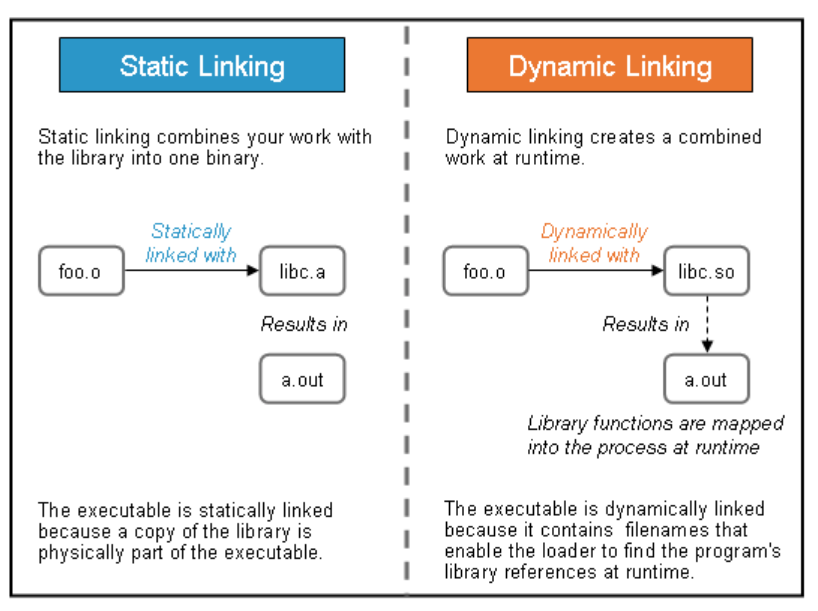

# 动态库和静态库的区别

[TOC]

库文件分两种：静态库和动态库（也叫共享库）。

windows下静态库扩展名为：.lib  动态库扩展名为.dll

linux系统下静态库扩展名为：.a  动态库扩展名为.so

## 一、静态库（归档文件）

静态库在编译期间自动从库中copy一份，链接到程序中，这个是在编译期是实现的。

静态库的优缺点

- 它相比与动态库更加脆弱，因为它直接融合到可执行文件中
- 当库发生变化时，程序需要重新连接和编译。
- 可执行文件尺寸更大
- 执行速度更快

## 二、动态库（共享库）

运行期间自动调用动态库中的函数，库函数与可执行文件是分开的。

动态库的优缺点：

- 在运行期间只有一份拷贝，可能存在多次调用
- 多个程序用一个库时不需要多份拷贝
- 可执行文件尺寸更小
- 动态库在运行期间连接，当库文件发生变化时不需要重新编译和连接。
- 当库出现问题时，可执行文件执行会收到影响；而静态库的话，函数已经编译到可执行文件，运行不会受到影响。