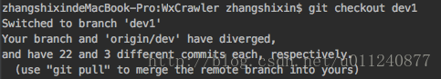

# Git HEAD detached from XXX(git HEAD游离)解决办法

[TOC]

## 什么是HEAD

Git中的HEAD可以理解为一个指针，我们可以在命令行中输入`cat .git/HEAD`查看当前HEAD指向哪儿，一般它指向当前工作目录所在分支的最新提交。

    

当使用 `git checkout <branch name>`切换分支时，HEAD会移动到指定分支。

    

但是如果使用`git checkout <commit id>`,即切换到指定某一次的提交，HEAD就会处于detached状态（游离状态）。

    

## HEAD游离状态的利与弊

HEAD处于游离状态时，我们可以很方便的在历史版本之间相互切换，比如需要回到某次提交，直接checkout对应的commit id 或者tag名即可。

它的弊端就是：**在这个基础上的提交会新开一个匿名分支！**

    

也就是我们的提交是无法可见保存的，一旦切换到别的分支，游离状态以后的提交就不可追溯了。

    

解决办法就是新建一个分支保存游离状态后的提交：

    

## 具体解决操作

1. `git branch -v `查看当前分支比领先多少

   <figure>
       
   </figure>

   4449a91指向的是dev1分支的最后一次提交

2. 新建一个temp分支，把当前提交的代码放到该分支

   <figure>
       
   </figure>

3. checkout出要回到的那个分支，这里是dev1

   <figure>
       
   </figure>

4. 然后merge刚才创建的临时分支，把那些代码merge进来

   <figure>
       
   </figure>

5. `git status`查看合并结果，如果有冲突就解决

   <figure>
       
   </figure>

6. 合并后，推动到远程

   <figure>
       
   </figure>

7. 删除刚才创建的临时分支

   <figure>
       
   </figure>

8. 查看log,当前HEAD指向本地dev1，和远端dev1一致

   <figure>
       
   </figure>

   

## 参考

[图解Git](<https://marklodato.github.io/visual-git-guide/index-zh-cn.html#detached>)

[git_fast_version_control](<https://git-scm.com/docs/git-checkout#_detached_head>)