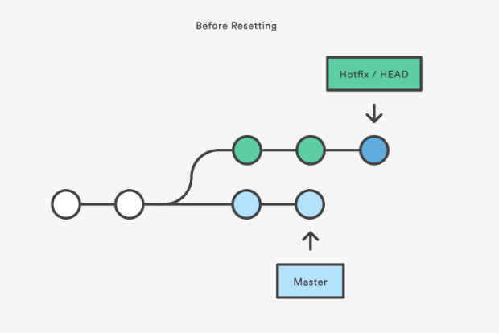
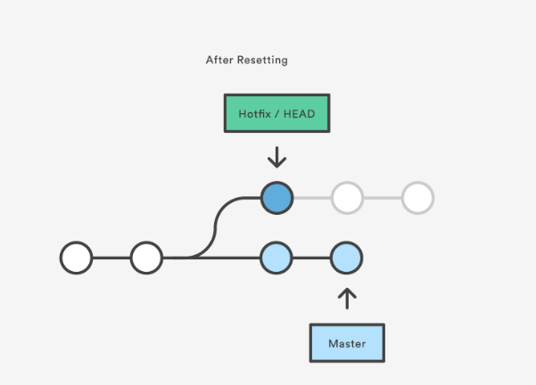
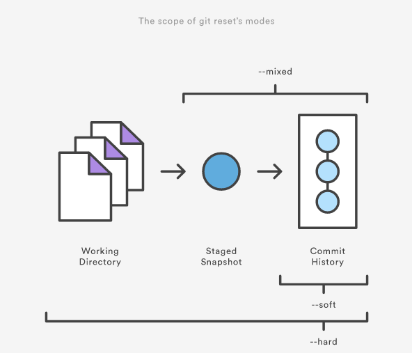
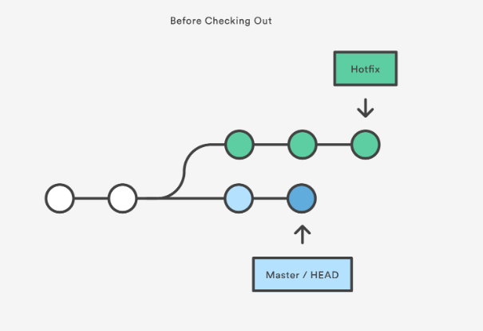
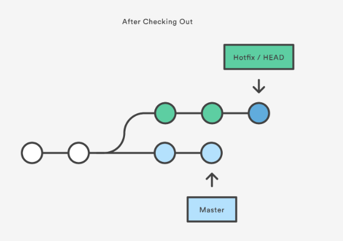
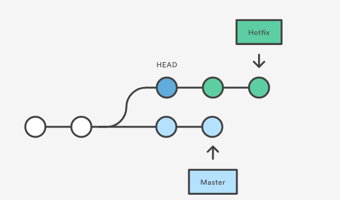
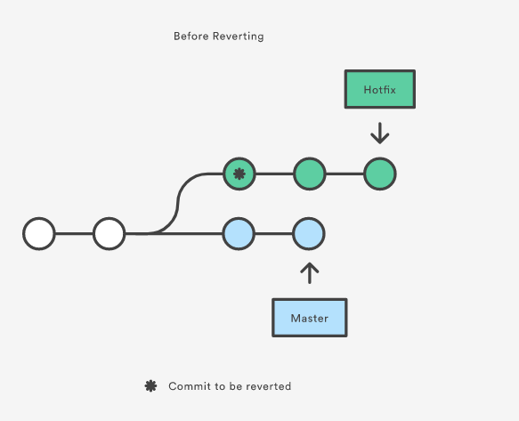
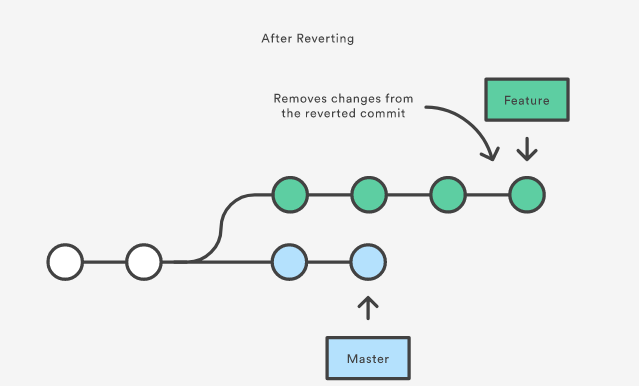
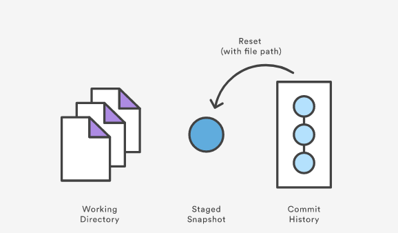
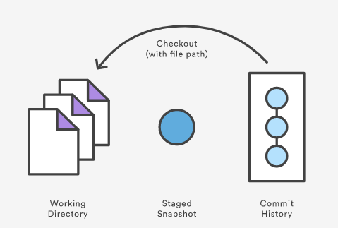

#  代码回滚：Reset,Checkout,Revert的选择
<a name = "返回页首"></a>

[TOC]

[表格](#chart)

## 1 提交层面的操作

&emsp; `git reset` 和 `git checkout` 的参数决定了它们的作用域。如果没有包含具体的文件路径，这些操作对所有的提交生效。注意，`git revert` 没有文件层面的操作。 

### 1 Reset

&emsp; 在提交层面上，reset将一个分支的末端指向另一个提交，这个操作可以用来移除当前分支的一些提交。比如下面这条命令让hotfix分支向后退了两个提交。

```
git checkout hotfix
git reset HEAD~2
```

&emsp; hotfix分支末端的两个提交现在变成了悬挂提交，下次Git执行垃圾回收的时候，这两个提交会被删除。换句话说，如果你想扔掉这两个提交，你可以这么操作。

<center>
    
</center>

+++

<center>
    
</center>

&emsp; 通过设置不同的参数，修改工作区或者缓存目录：

- --soft—缓存区和工作区的目录都不会改变，仅仅是HEAD指向了之前的提交
- --mixed—默认选项。缓存区和你指定的提交同步，但工作目录不受影响
- --hard—缓存区和工作区都同步到你指定的提交。

把这些参数想象成定义`git reset`操作的作用域更加容易理解。

<center>
    
</center>

&emsp; 这些标记通常和HEAD作为参数一起使用。比如，`git reset --mixed HEAD` 将你的改动从缓存区中移除，但是改动依然保留在工作区间。另一方面，如果你想完全舍弃你没有提交的改动，可以使用`git reset --hard HEAD`。

&emsp; 当你传入HEAD以外的其他提交的时候要格外小心，因为reset会重写当前分支的历史。正如rebase黄金法则所说，在公共分支上这样操作会引起严重的后果。

### 2 Checkout

&emsp; 提交层面使用。当传入分支名时，可以切换到那个分支。

```
git checkout hotfix
```

&emsp; 上面这个命令将HEAD移动到一个新的分支，然后更新工作目录。因为这个可能会覆盖本地的修改，Git强制你提交或者缓存工作目录中的所有更改，否则在checkout的时候这些更改都会丢失。和reset不同的是，`git checkout`没有前后移动这些分支。

<center>
    
</center>

+++

<center>
    
</center>

&emsp; 除了切换分支，还可以传入提交的commit ID来切换到任意的提交。比如下面这个命令会切换到当前提交的祖父提交。

```
git checkout HEAD~2
```

<center>
    
</center>

&emsp; 这对于快速查看项目旧版本来说非常有用。但是如果你当前的HEAD没有其他分支，那么这会造成HEAD分离。这是非常危险的，如果你接着添加新的提交，然后切换到别的分支之后，就没有办法回到之前添加的这些提交。因此，在为分离的HEAD添加新的提交的时候应该创建一个新的分支。

```
///切换到其他commit,容易造成HEAD游离问题，这个需要新建分支保存新的当前提交，然后merge就可以。
HEAD detached from XXX
```

### 3 Revert

&emsp; Revert撤销一个提交的同时会创建一个新的提交。这是一个安全的方法，因为它不会重写提交历史。比如，下面的命令会找出倒数第二个提交，然后创建一个新的提交来撤销这些更改，然后把这个提交加入项目中。

```
git checkout hotfix
git revert HEAD~2
```

&emsp; 如下图所示，revert回倒数第二个commit

<center>
    
</center>

+++

<center>
    
</center>

&emsp; 相比`git reset`, `git revert`不会改变现在的提交历史。因此，`git revert` 可以用在公共分支上，`git reset`应该用在私有分支上。

&emsp; 你也可以把`git revert` 当作撤销已经提交的修改，而`git reset HEAD`用来撤销没有提交的修改。

&emsp; 就像`git checkout`一样，`git revert` 也有可能会重写文件。所以Git会在你执行revert之前要求你提交或者缓存你工作目中的所有更改。

## 2 文件层面的操作

&emsp; `git reset` 和`git checkout`命令也可以接受文件路径作为参数，这是其含义就大为不同。它不会作用于整份提交，参数将限制于特定文件。

### 1 Reset

&emsp; 当检测到文件路径时，`git reset`将缓存同步到你指定的那个提交。比如，下面的命令会将倒数第二个提交中的foo.py加入到缓存区中，供下一个提交使用。

```
git reset HEAD~2 foo.py
```

&emsp; 和提交层面的`git reset`一样，通常我们使用HEAD而不是某个特征的提交。运行`git reset HEAD foo.py` 会将当前的foo.p的更改从缓存区中移除，而不会影响工作目录中对foo.py的修改。将一个文件从commit历史中移动到stage缓存中。

<center>
    
</center>


&emsp; --soft,--mixed,--hard对文件层面的`git reset`毫无作用，因为缓存区中的文件一定会变化，而工作目录中的文件一定不变。

### 2 Checkout

&emsp; Checkout一个文件和带文件路径 `git reset` 非常像，除了它更改的是工作目录而不是缓存区。不像提交层面的checkout命令，它不会移动HEAD引用。

<center>
    
</center>

&emsp; 比如，下面这个命令将工作目录中的foo.py同步到了倒数第二个提交中的foo.py。

```
git checkout HEAD~2 foo.py
```

&emsp; 和提交层面相同的是，它可以用来检测项目的旧版本，但作用于被限制到了特定文件。

&emsp; 如果你缓存并且提交了checkout的文件，它具备将某个文件撤回到之前版本的效果。注意它撤销了这个文件后面所有的更改，而revert命令只撤销某个特定提交的更改。

&emsp; 和`git reset`一样，这个命令通常和HEAD一起使用，比如`git checkout HEAD foo.py`等同于舍弃foo.py没有缓存的更改。这个行为和`git reset HEAD --hard`很像，但是只影响特定文件。

<a name = "chart"></a>

|     命令     |  作用域  |              常用情景              |
| :----------: | :------: | :--------------------------------: |
|  git reset   | 提交层面 | 在私有分支上舍弃一些没有提交的更改 |
|  git reset   | 文件层面 |        将文件从缓存区中移除        |
| git checkout | 提交层面 |        切换分支或查看旧版本        |
| git checkout | 文件层面 |        舍弃工作目录中的修改        |
|  git revert  | 提交层面 |        在公共分支上滚回更改        |
|  git revert  | 文件层面 |            没有相关操作            |

[点击返回页首](#返回页首)