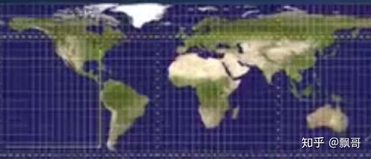

# 常用的八大坐标系

- ## 地心惯性坐标系（ECI）

  

地心惯性坐标系的原点位于地球原点，**z轴**沿地轴指向北极，**x轴**和**y轴**位于赤道平面，与**z轴**满足右手法则，并且**x轴**和**y轴**分别指向两个恒星。这个坐标系不会随着地球的自转而变化，是一个固定的坐标系。这个坐标系的作用是在地球表面这些载体，在运动时候的相对惯性，是相对于这个坐标系的。我们讲的IMU检测或者计算到的加速度和角速度都是相对于地心惯性坐标系的。

- ## 地心地固坐标系（ECEF）

地心地固坐标系坐标系如图绿色坐标系所示，其原点位于地球的原点，**z轴**沿着地轴指向北极，**x轴**沿着赤道平面与格林威治子午面的交线上，**y轴**在赤道平面与**x轴z轴**满足右手法则（常用**wgs84**坐标系）。这个坐标系随着地球的自转而转，以地球为base，某些时刻是和eci坐标系是一样的，它于eci坐标系存在一个时间的旋转。

- ## 当地水平坐标系

当地水平坐标系如图中蓝色坐标系所示，当地水平坐标系（i系）的原点位于载体所在的地球表面，**x轴**和**y轴**在当地水平面内，分别指向东向和北向，**z轴**垂直向上，与**x轴y轴**满足右手法则。该坐标系是机器人领域通常所说的世界坐标系，在导航解算过程中通常也罢该坐标系选取为导航坐标系，也成为**东-北-天**（**e-n-u**）坐标系，与之对应有**北-东-地**（**n-e-d**）坐标系。 

- ## UTM投影坐标系

UTM投影全称为**通用横轴墨卡托投影**是一种等角横轴割圆柱投影，椭圆柱割地球于**南纬80度**，**北纬84度**两条等高圈。前面的大地坐标系做定位不是很好用，不像我们平时用的水平地图。这个UTM地图根据经纬度做划分，通过经度把地球分成60个区域，每6度一个区域，北京在第50个区域，南北也做了划分，相当于把地球分成了很多块。平时定位输出的坐标系就是这个坐标系，坐标xy,再加一个投影带的代号，就是0~59或1～60，可以换算成大地坐标系或经纬度。

- ## 车体坐标系

  

车体坐标系原点在载体质量中心与载体固连（对于车载，选取原点位于后轴中心位置），**x轴**沿着载体轴指向**右**，**y轴**指向**前**，**z轴**与**x轴**，**y轴**满足右手法则指向**天**。该坐标系通常称为**右-前-上**（**r-f-u**）坐标系，于是对应还有**前-左-上**（**f-l-u**）。建立这个坐标系是为了和当地坐标系匹配起来，该坐标系是一个局部坐标系，它与当地水平坐标系用旋转和平移来表示现在的位置和姿态。

- ## IMU坐标系

IMU坐标系的坐标原点在陀螺仪和加速度计的坐标原点，xyz三个轴分别于陀螺仪和加速度计对应的轴相平行。IMU装在车体的一个点上，IMU坐标系和载体坐标系一样，具体指向取决于我们安装。

- ## 相机坐标系

如图所示o点为摄像机光心（投影中心），**xc轴**和**yc轴**与成像平面坐标系的**x轴**和**y轴**平行，**zc轴**为摄像机的光轴，和图像平面垂直。由点**o,xc,yc,zc**组成的直角坐标系成为相机坐标系。相机坐标系一般**x轴**朝右，**y轴**朝下，**z轴**朝前。

- ## 激光雷达坐标系

如图所示激光雷达坐标系以及俯视图，激光雷达坐标系的原点位于多线束中间旋转轴的交点处，**z轴**沿着轴线向上，**x轴**向前，**y轴**向左，其测量的点坐标是在激光雷达坐标系下的三维坐标。